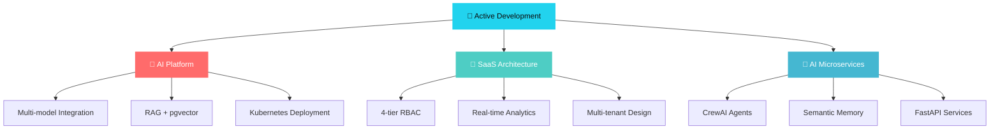

<!--
╔══════════════════════════════════════════════════════════════════════════════╗
║   KARNAN SP · GITHUB PROFILE README                  ║
║   Industrial Precision · Full Stack · AI Engineer    ║
╚══════════════════════════════════════════════════════════════════════════════╝
-->

<div align="center">


<br/>


<br/><br/>

<div align="center">
  <a href="mailto:karnansp36@gmail.com">
    
  </a>
  &nbsp;&nbsp;
  <a href="https://linkedin.com/in/karnan-sp-8280b9288">
    
  </a>
  &nbsp;&nbsp;
  <a href="https://github.com/karnansp36">
    
  </a>
</div>

<br/>

<div align="center">
  
  &nbsp;&nbsp;
  
</div>

</div>

<br/>

<div align="center">

```
╭─────────────────────────────────────────────────────────────────╮
│                          SYSTEM PROFILE                        │
╰─────────────────────────────────────────────────────────────────╯
```

</div>

<table width="100%">
<tr>
<td width="55%" valign="top">

```typescript
/**
 * @name    Karnan SP
 * @role    Full Stack Developer & AI Engineer
 * @base    Salem, Tamil Nadu, India 🇮🇳
 * @status  Open to Contribute
 */

interface Developer {
  readonly expertise: {
    frontend  : ["React", "Next.js", "TypeScript", "Tailwind"];
    backend   : ["Node.js", "Express", "Django", "FastAPI"];
    databases : ["MongoDB", "PostgreSQL", "MySQL", "Redis"];
    ai        : ["CrewAI", "RAG", "pgvector", "Semantic Memory"];
    cloud     : ["AWS EC2/S3/RDS", "Cloudflare", "Docker"];
    devops    : ["Kubernetes", "Nginx", "GitHub Actions"];
  };
  
  readonly currentlyShipping: [
    "🤖 Multi-model AI chat platforms",
    "🏢 Multi-tenant SaaS with 4-tier RBAC", 
    "🧠 AI microservices with semantic memory"
  ];
  
  readonly motto: "Ship fast · Scale smart · Code clean ☕";
}

const karnanSP: Developer = { /* ... */ };
```

</td>
<td width="3%"></td>
<td width="42%" valign="top">

<br/>

**`// Current Focus`**

```bash
◈  AI agent orchestration · CrewAI
◈  Semantic memory · pgvector  
◈  Multi-tenant SaaS architecture
◈  AWS production deployments
◈  Cloudflare edge optimization
```

<br/>

**`// 2025 Shipped`**

```bash
✦  Pro Inventory     → Live SaaS
✦  aiChat            → AI Platform  
✦  Personal Manager  → AI Service
```

<br/>

**`// Proficiency Matrix`**

```bash
JavaScript/TypeScript  ████████████  92%
Python/Django/FastAPI  ███████████░  85%
React/Next.js          ████████████  88%
AWS/Docker/K8s         █████████░░░  75%
AI/Agents/RAG          ████████░░░░  68%
```

</td>
</tr>
</table>

<br/>

<div align="center">

```
╭─────────────────────────────────────────────────────────────────╮
│                         TECH ARSENAL                           │
╰─────────────────────────────────────────────────────────────────╯
```

</div>

<div align="center">

<table>
<tr>
<td align="center" width="20%">

**Frontend**


</td>
<td align="center" width="20%">

**Backend**


</td>
<td align="center" width="20%">

**Data**


</td>
<td align="center" width="20%">

**Cloud**


</td>
<td align="center" width="20%">

**AI/ML**


</td>
</tr>
</table>

</div>

<br/>

<div align="center">

```
╭─────────────────────────────────────────────────────────────────╮
│                      FEATURED PROJECTS                         │
╰─────────────────────────────────────────────────────────────────╯
```

</div>

<div align="center">

<table width="100%">
<tr>
<td width="33%" align="center">

### 🏢 Pro Inventory
**Multi-Tenant SaaS**

[](https://pro-inventory.vercel.app)
[](https://github.com/karnansp36/pro_inventory)

```
MERN Stack
JWT + 4-Tier RBAC
Multi-payment Engine
Real-time Analytics
```

**Features:** Sales automation, inventory management, role-based access, audit trails

</td>
<td width="33%" align="center">

### 🤖 aiChat
**AI Platform**

[](https://github.com/karnansp36/aiChat)


```
React + TypeScript
Multi-model Support
RAG + pgvector
Kubernetes Ready
```

**Features:** AI agents, code interpreter, generative UI, enterprise auth

</td>
<td width="33%" align="center">

### 🧠 Personal Manager
**AI Microservice**

[](https://github.com/karnansp36/fast_api)


```
FastAPI + CrewAI
Semantic Memory
WebSocket Real-time
Celery Workers
```

**Features:** Natural language scheduling, empathetic AI, multi-LLM orchestration

</td>
</tr>
</table>

</div>

<br/>

<div align="center">

```
╭─────────────────────────────────────────────────────────────────╮
│                      GITHUB ANALYTICS                          │
╰─────────────────────────────────────────────────────────────────╯
```

</div>

<div align="center">

<table>
<tr>
<td align="center">


</td>
<td align="center">


</td>
<td align="center">


</td>
</tr>
</table>

<br/>


</div>

<br/>

<div align="center">

```
╭─────────────────────────────────────────────────────────────────╮
│                    CONTRIBUTION SNAKE                          │
╰─────────────────────────────────────────────────────────────────╯
```

</div>

<div align="center">

<picture>
  <source media="(prefers-color-scheme: dark)" srcset="https://github.com/karnansp36/karnansp36/blob/output/github-contribution-grid-snake-dark.svg" />
  <source media="(prefers-color-scheme: light)" srcset="https://github.com/karnansp36/karnansp36/blob/output/github-contribution-grid-snake.svg" />
  
</picture>

</div>

<br/>

<div align="center">

```
╭─────────────────────────────────────────────────────────────────╮
│                       CURRENT FOCUS                            │
╰─────────────────────────────────────────────────────────────────╯
```

</div>

<div align="center">



</div>

<br/>

<div align="center">

```
╭─────────────────────────────────────────────────────────────────╮
│                        CONNECT                                 │
╰─────────────────────────────────────────────────────────────────╯
```

</div>

<div align="center">

<table width="80%">
<tr>
<td align="center" width="33%">

💼 **Professional**

Opportunities & Collaboration

[](https://linkedin.com/in/karnan-sp-8280b9288)

</td>
<td align="center" width="33%">

📧 **Direct Contact**

Project Discussions

[](mailto:karnansp36@gmail.com)

</td>
<td align="center" width="33%">

💻 **Open Source**

Latest Code & Contributions

[](https://github.com/karnansp36)

</td>
</tr>
</table>

<br/>

### 🤝 Open to Contribute

Actively contributing to open-source projects in **AI/ML Tooling**, **Developer Frameworks**, and **Cloud-Native Infrastructure**.

**Contribution Areas:** AI Agent Frameworks • Full Stack SaaS Templates • DevOps Automation • Open Source Libraries

</div>

<br/>

<div align="center">


<br/>


<br/><br/>

**⭐ If you find my work interesting, consider starring my repositories!**

</div>
